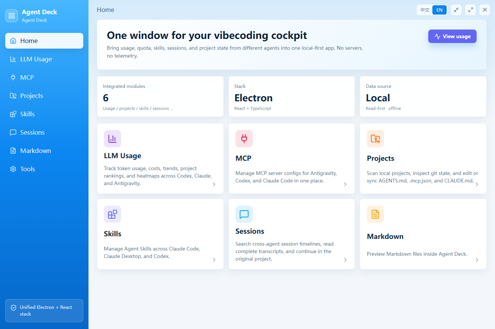
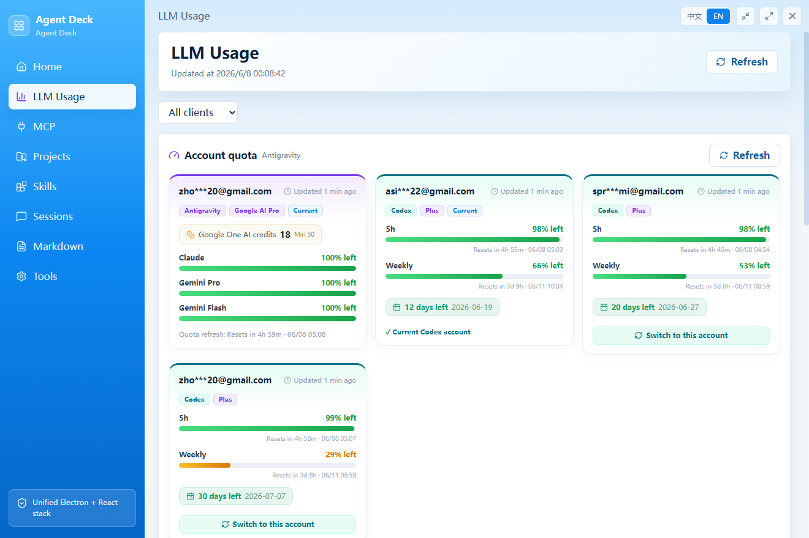
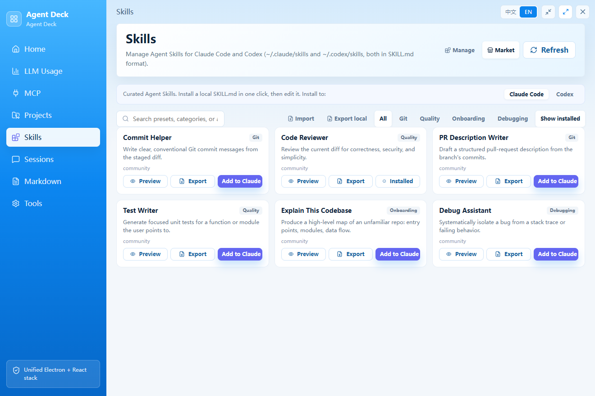
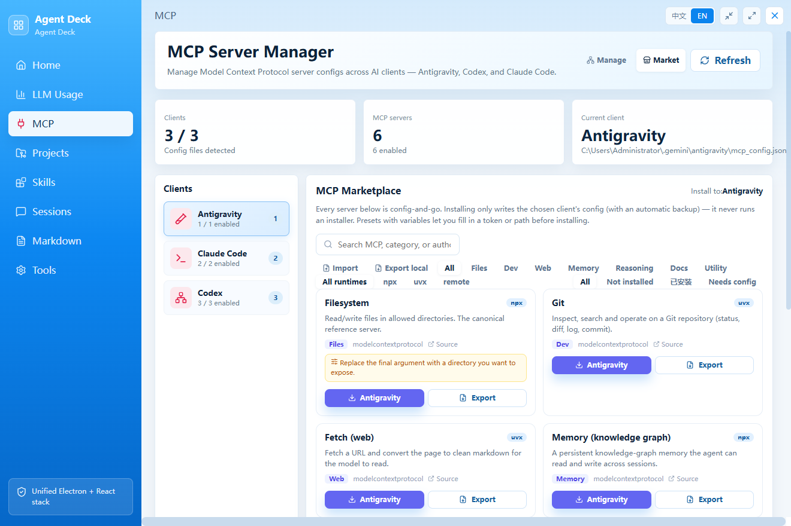

# Agent Deck · Agent 指挥台

<p align="center">
  
</p>

<p align="center">
  <a href="https://opensource.org/licenses/MIT"></a>
  
  
  <a href="https://github.com/xiaozpp/Agent-Deck/actions/workflows/ci.yml"></a>
</p>

<p align="center">
  <b>English</b> | <a href="README_zh.md">简体中文</a>
</p>

---

> **A control center for your AI coding agents that never phones home.**
> Your OAuth tokens never leave the Electron main process. There is no network client, no telemetry, no account. Everything is read from your own disk.

**Agent Deck** pulls the scattered state of **Claude Code**, **Codex**, and **Antigravity** into one window — usage and cost, remaining quota, agent skills, MCP servers, conversation history, and workspace git status. Instead of juggling half a dozen CLI windows, terminal logs, and config files, you get one cohesive, **local-first** desktop app.

Most tools in this space are either web dashboards (your data leaves your machine) or single-purpose utilities. Agent Deck is different on two axes that are hard to copy:

- **🔒 Privacy is the product.** Token-bearing files are parsed *only* in the main process; nothing but safe display fields (plan name, usage %) ever crosses the IPC boundary into the UI. Emails are masked by default. The app has no outbound network of its own.
- **🎛️ Breadth in one place.** Seven tools that normally live in seven terminals, unified — and every config write is confined to your workspace, backed up, and validated first.

---

## ✨ Highlights

### 📊 LLM Usage Analytics
Track tokens, cost, and habits in real time across **Codex**, **Claude Code**, and **Antigravity** (powered by [`tokscale`](https://www.npmjs.com/package/tokscale) + [`ccusage`](https://www.npmjs.com/package/ccusage)).
* Aggregated cost, input/output/cache tokens, and a GitHub-style **53-week activity heatmap**.
* Per-project rankings and per-model cost breakdowns to find where your tokens go.

<p align="center"></p>

### 🔋 Battery-style Quota & Account Switching
* Intuitive **remaining-percentage bars** for active models and billing windows, read directly from the local [cockpit-tools](https://github.com/jlcodes99/cockpit-tools) cache.
* **Safe one-click account switching** for Codex — rewrites and validates `auth.json` atomically, with an automatic backup.

### 🧩 Unified Agent Skills Manager
* Auto-indexes personal, plugin, and system skills for **Claude Code**, **Claude Desktop**, and **Codex**.
* Review, edit, enable/disable, open, or delete any skill.
* A curated, **offline** starter marketplace (commit helper, code reviewer, PR writer, test writer, codebase explainer, debug assistant) — install writes a ready-to-edit `SKILL.md` into the agent you choose.

<p align="center"></p>

### 🔌 MCP Server Manager
* Read and write MCP configs for **Claude Code** (`~/.claude.json`), **Codex** (`~/.codex/config.toml`), and **Antigravity** — JSON and TOML handled transparently behind an adapter.
* Full CRUD for `stdio` and remote (HTTP) servers, including `env` and headers; duplicate a working server across clients in one click (with backups).
* A curated **offline** marketplace of "config-and-go" servers — install writes the config entry only, it **never runs an installer**.

<p align="center"></p>

### 🔍 Cross-Agent Session Timeline
* **Full-text search** across all past Claude Code and Codex chats and terminal sessions.
* Clean transcript rendering, and **one-click resume** of a fresh agent session in the exact project directory.

### 🎛️ Workspace Command Center
* Scan local repos for branch, dirty state, and ahead/behind status.
* Edit per-project agent prompts (`AGENTS.md`, `.mcp.json`, `CLAUDE.md`) and **sync a standardized template across many projects at once** (with backups).

### 📝 Embedded Markdown Viewer
* Preview any local Markdown file inside the app, with local images fully resolved.

---

## 🔒 Security & Privacy

Agent Deck reads data files produced by other tools on your disk, so security is the top priority:

* **OAuth tokens stay local.** Files with access keys are parsed exclusively in the Electron main process. Only safe display fields cross IPC into React — tokens never do.
* **Email masking by default.** Account emails are obfuscated at the IPC boundary (`dev***@domain.com`) so they don't leak during screen-sharing. Opt out with `TOOL_MASTER_SHOW_EMAILS=1`.
* **Safe config writes.** Writes are confined to your workspace root, create a timestamped `.bak-<timestamp>` first, and are JSON-validated before saving.
* **Zero telemetry.** The app has no network client of its own. Nothing is phoned home.

### Paths Agent Deck accesses

| Target | Purpose | Mode |
|---|---|---|
| `~/.claude/projects/**.jsonl` | Claude Code session history | Read-only |
| `~/.codex/sessions/**.jsonl` | Codex session history | Read-only |
| `~/.claude/skills`, `~/.codex/skills` | Agent Skills discovery & editing | Read/Write |
| `%APPDATA%/Claude/.../skills-plugin/**` | Claude Desktop skills | Read-only |
| `~/.antigravity_cockpit/**` | cockpit-tools quota cache | Read-only |
| `~/.codex/auth.json` | Codex active account | Read/Write |
| `<WORK_ROOT>/*` (default `~/projects`) | Project dirs + `AGENTS.md`/`.mcp.json`/`CLAUDE.md` | Read/Write |

---

## 🛠️ Getting Started

> **Platform:** Agent Deck is currently **Windows-only** — it is built and tested on Windows 10/11. The code itself is largely cross-platform, but macOS/Linux paths and packaging are not yet validated. See [Roadmap](#-roadmap).

### Prerequisites
* **OS:** Windows 10 / 11
* **Node.js:** v20.19+ (Node 20 LTS) or v22.12+

### Run from source
```bash
git clone git@github.com:xiaozpp/Agent-Deck.git
cd Agent-Deck
npm install
npm start          # Vite dev server + Electron window
```

### Build a portable Windows .exe
```bash
npm run package:win
```

### Run all checks (tests + typecheck + production build + syntax)
```bash
npm run check
```

### Configuration (environment variables)

| Variable | Default | Purpose |
|---|---|---|
| `TOOL_MASTER_WORK_ROOT` | `~/projects` | Directory scanned for local coding projects. |
| `TOOL_MASTER_SHOW_EMAILS` | (unset) | Set to `1` to show full account emails (disable masking). |
| `CCUSAGE_BIN` / `TOKSCALE_BIN` | (auto) | Override paths to the usage-tracker binaries. |

### Extend the offline marketplaces (no source edits)
* `config/mcp-presets.json` — array of MCP presets (`id`, `name`, `install` required; `${VAR}` placeholders are prompted before install).
* `config/skill-presets/*.md` — one Skill preset per file; frontmatter sets metadata, the body becomes `SKILL.md`.

---

## 🗺️ Roadmap

* **macOS & Linux support** — the UI is web tech and most file access uses `os.homedir()`, so the groundwork is there. What's missing is platform-specific path mapping (e.g. `~/Library/Application Support/Claude` on macOS) and packaging. **Help wanted** — if you run macOS or Linux, contributions and testing are very welcome.
* Theming / dark mode.

---

## 🌐 Internationalization

The UI ships in **English** and **Simplified Chinese**. It follows your system language on first launch, and a title-bar switch (`中文` / `EN`) lets you change it anytime.

---

## 🤝 Contributing

Contributions are welcome — see **[CONTRIBUTING.md](./CONTRIBUTING.md)**. In short: any code touching user credentials must follow the **No Spread** rule (forward only an explicit allow-list of metadata fields across the IPC bridge; never serialize whole token objects), and file writes must be confined + backed up + validated. `npm run check` must pass on every PR.

## 📄 License

Licensed under the [MIT License](./LICENSE).

*Disclaimer: Agent Deck is an independent open-source tool and is not officially affiliated with Anthropic, OpenAI, Google, or cockpit-tools.*
