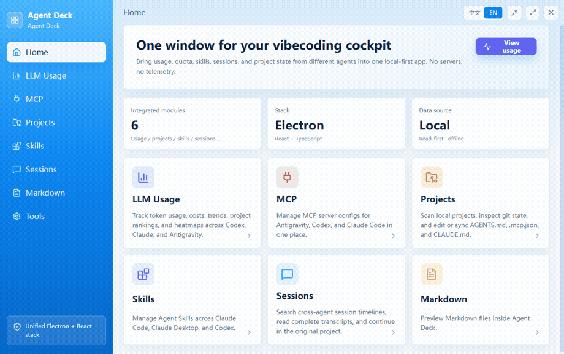

# Agent Deck · Agent 指挥台

<p align="center">
  
</p>

<p align="center">
  <a href="https://opensource.org/licenses/MIT"></a>
  
  
  <a href="https://github.com/xiaozpp/Agent-Deck/actions/workflows/ci.yml"></a>
</p>

<p align="center">
  <a href="https://github.com/xiaozpp/Agent-Deck/releases/latest"></a>
</p>

<p align="center">
  <a href="README.md">English</a> | <b>简体中文</b>
</p>

---

> **看清你的 token 花在哪、找回你和 Agent 的每一次对话、统一管理项目上下文 —— 全程本地，绝不联网。**

**Agent Deck**（Agent 指挥台）是为长在 **Claude Code** 和 **Codex** 里的开发者做的**本地优先仪表盘 + 记忆库**。它读取这些 Agent 本就留在你硬盘上的数据，把它变成你真正能*看见、能搜索*的东西:成本分析、可搜索的全部对话历史,以及一处管理那些操控 Agent 的提示词与配置。

切换账号/Provider 已经有不错的工具——比如 [Cockpit Tools](https://github.com/jlcodes99/cockpit-tools) 和 [cc-switch](https://github.com/farion1231/cc-switch)。Agent Deck **刻意不去抢**这条赛道,而是专注它们*不做*的事,并且做到**无代理、无云账号、零遥测**。

---

## 🪧 它的不同之处

### 📊 用量 & 成本分析 —— *看清 token 花在哪*
这里没有别人在做的一块:把原始 token 日志变成真正的洞察,横跨 **Codex**、**Claude Code**、**反重力**(由 [`tokscale`](https://www.npmjs.com/package/tokscale) + [`ccusage`](https://www.npmjs.com/package/ccusage) 驱动)。
* 聚合费用、输入/输出/缓存 token,GitHub 风格 **53 周热力图**,项目排行,按模型的费用拆解。
* 电池条式**剩余配额**,额度见底不再被打个措手不及。

<p align="center"></p>

### 🔍 会话记忆 —— *搜索你和 Agent 的每一次对话*
Agent 会忘,Agent Deck 不会。它把你机器上**每一个 Claude Code 与 Codex 会话**索引成一条可搜索的时间线:
* 对标题、项目、以及历史对话的**完整正文做全文搜索**——并**直接在结果里显示命中的片段**,让你一眼看到*为什么*这条会话被匹配到。
* 干净的对话渲染,以及**一键在原项目目录拉起新会话**。
* 这条全网同类工具都没做——它是你私有的、跨 Agent 的长期记忆。

### 🎛️ 项目 & 提示词上下文 —— *管理操控 Agent 的东西*
* 扫描本地仓库,查看分支、是否有改动、领先/落后状态。
* 编辑每个项目的 Agent 提示词(`AGENTS.md`、`.mcp.json`、`CLAUDE.md`),并可**一次性把标准模板同步到多个项目**(自动备份)。

### 🔒 只读仪表盘,不是代理
这是架构上的一条底线:
* **无代理、无云同步、无遥测、无账号。** Agent Deck *读取* Agent 本就写下的文件,绝不挡在你的流量中间。
* **Token 永不离开主进程。** 含凭据的文件只在 Electron 主进程解析;只有安全展示字段会进入 UI,邮箱默认打码。

---

## 🧰 还包含

把指挥台凑齐。这些与专门工具有重叠——你爱用哪个继续用,Agent Deck 只是帮你省一个窗口。

* **🔋 配额 & 账号切换** —— 从本机 [Cockpit Tools](https://github.com/jlcodes99/cockpit-tools) 缓存读取剩余百分比电池条,以及安全的 Codex `auth.json` 一键切号(原子化、自动备份)。*Agent Deck 读的就是 Cockpit 的缓存,两者天然协作。*
* **🔌 MCP 服务器管理** —— 读写 Claude Code / Codex / 反重力的 MCP 配置(JSON + TOML),完整增删改查,跨客户端复制,以及一个**绝不执行安装命令**的离线"写配置即用"市场。
* **🧩 Agent Skills 管理** —— 索引、编辑、启停 Claude Code / Claude 桌面版 / Codex 的技能,含离线起步市场。
* **📝 Markdown 查看器** —— 预览本地 Markdown,图片完整解析。

<p align="center">
  
  
</p>

---

## 🔒 安全与隐私

Agent Deck 会读取磁盘上其他工具生成的数据文件，因此安全是第一优先级：

* **OAuth 凭据只留本地。** 含访问密钥的文件只在 Electron 主进程解析。只有安全展示字段会跨 IPC 进入 React——凭据永远不会。
* **邮箱默认打码。** 账号邮箱在 IPC 边界被打码（`dev***@domain.com`），避免直播/分享屏幕时泄露。可用 `TOOL_MASTER_SHOW_EMAILS=1` 关闭。
* **安全写配置。** 写入限制在工作区根目录内，先生成带时间戳的 `.bak-<时间戳>` 备份，并在保存前做 JSON 校验。
* **零遥测。** 应用自身没有网络客户端，不会回传任何数据。

### Agent Deck 访问的路径

| 目标 | 用途 | 模式 |
|---|---|---|
| `~/.claude/projects/**.jsonl` | Claude Code 会话历史 | 只读 |
| `~/.codex/sessions/**.jsonl` | Codex 会话历史 | 只读 |
| `~/.claude/skills`、`~/.codex/skills` | Agent Skills 发现与编辑 | 读写 |
| `%APPDATA%/Claude/.../skills-plugin/**` | Claude 桌面版技能 | 只读 |
| `~/.antigravity_cockpit/**` | cockpit-tools 配额缓存 | 只读 |
| `~/.codex/auth.json` | Codex 当前账号 | 读写 |
| `<WORK_ROOT>/*`（默认 `~/projects`） | 项目目录 + `AGENTS.md`/`.mcp.json`/`CLAUDE.md` | 读写 |

---

## 🛠️ 快速开始

> **平台：** Agent Deck 目前**仅支持 Windows**——在 Windows 10/11 上构建与测试。代码本身大体跨平台，但 macOS/Linux 的路径与打包尚未验证。见 [路线图](#-路线图)。

### 下载（多数用户推荐）

从 **[Releases 页面](https://github.com/xiaozpp/Agent-Deck/releases/latest)** 下载最新的便携版 `.exe`——免安装，双击即用。

> **Windows SmartScreen 提示：** 当前版本尚未做代码签名，首次运行时 Windows 可能弹出 *"Windows 已保护你的电脑"*。点击 **更多信息 → 仍要运行** 即可。（源码在本仓库完全开放，介意的话也可以自己审阅或构建。）

### 从源码构建

### 前置要求
* **系统：** Windows 10 / 11
* **Node.js：** v20.19+（Node 20 LTS）或 v22.12+

### 从源码运行
```bash
git clone git@github.com:xiaozpp/Agent-Deck.git
cd Agent-Deck
npm install
npm start          # Vite 开发服务器 + Electron 窗口
```

### 打包便携版 Windows .exe
```bash
npm run package:win
```

### 跑全部检查（测试 + 类型检查 + 生产构建 + 语法）
```bash
npm run check
```

### 配置（环境变量）

| 变量 | 默认 | 用途 |
|---|---|---|
| `TOOL_MASTER_WORK_ROOT` | `~/projects` | 扫描本地编程项目的目录。 |
| `TOOL_MASTER_SHOW_EMAILS` | （未设置） | 设为 `1` 显示完整账号邮箱（关闭打码）。 |
| `CCUSAGE_BIN` / `TOKSCALE_BIN` | （自动） | 覆盖用量统计二进制的路径。 |

### 扩展离线市场（无需改源码）
* `config/mcp-presets.json` — MCP preset 数组（必填 `id`、`name`、`install`；`${VAR}` 占位符会在安装前提示填写）。
* `config/skill-presets/*.md` — 每个文件一个 Skill preset；frontmatter 设置元数据，正文成为 `SKILL.md`。

---

## 🗺️ 路线图

* **macOS 与 Linux 支持** — UI 是 web 技术，且文件访问大多用 `os.homedir()`，底子已经在。缺的是平台相关的路径映射（如 macOS 上的 `~/Library/Application Support/Claude`）与打包。**欢迎贡献**——如果你用 macOS 或 Linux，非常欢迎提交代码与测试。
* 主题 / 暗色模式。

---

## 🌐 多语言

界面提供 **English** 与 **简体中文** 两种语言。首次启动跟随系统语言，标题栏的 `中文` / `EN` 开关可随时切换。

---

## 🤝 参与贡献

欢迎贡献——见 **[CONTRIBUTING.md](./CONTRIBUTING.md)**。简而言之：任何涉及用户凭据的代码必须遵守 **No Spread** 规则（只通过 IPC 桥转发明确白名单内的元数据字段，绝不序列化完整 token 对象）；文件写入必须限制范围 + 备份 + 校验。每个 PR 都必须通过 `npm run check`。

## 📄 许可证

基于 [MIT License](./LICENSE) 授权。

*免责声明：Agent Deck 是独立的开源工具，与 Anthropic、OpenAI、Google 或 cockpit-tools 无官方关联。*
